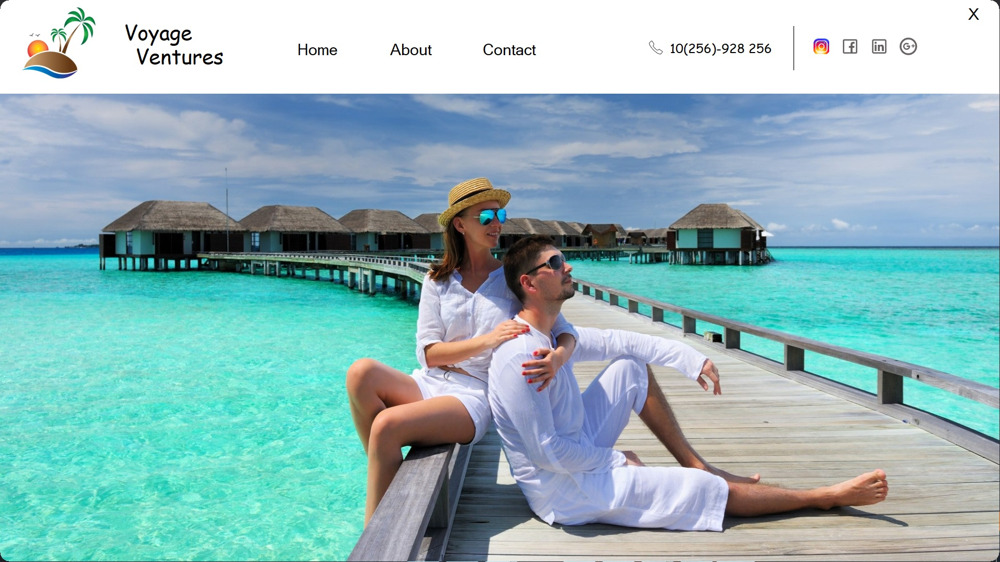

# Voyage-Ventures

This is our DataBase Management (DBS) project. We made this project for the final evaluation of the DBS lab held in the 4th semester.
It is a full fledged travel management system designed to make the whole process of planning and booking their dream holiday easier. 

Team members- 
- Anutham Krishnan
- Aditya Verma
- Sahil Khose
- Sankalp Shubham

All of us contributed equally in the ER diagram and normalization process. Although, the frontend was handled majorly by Anutham and Sahil. Making the frontend (which included all the forms, UI and integration) in C# was a bit of challenge but our teammates did a really good job.

Backend work(Sql database, maintaining data and relevant functions, procedures and queries) was mainly handled by Aditya and Sankalp.

The project was a fun and overwhelming experience. We learnt about how things get complex when scaled up. Planning in advanced using E-R diagram is essential.
## Technologies used

**Backend**: Oracle SQL 11g
**Frontend**: C# 

## Features

- Booking system for Hotels, Flights and other means of transports as well.
- Booking for nearby attractions and eateries
- User portal with basic security features and option for membership privileges
- A review system based on user reviews for attractions, eateries and hotels.
